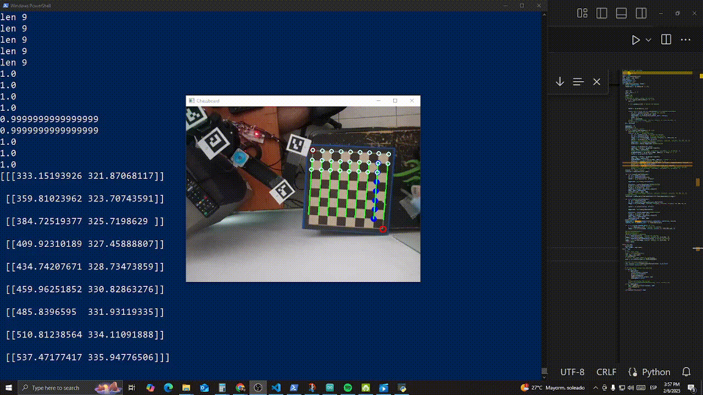

# SCARA Chess Robot
## Overview
A SCARA-type robot designed to play chess, integrating robotics, embedded systems, and computer vision.

### Key Features
✅ Computer Vision-Based Control – Uses OpenCV to detect and recognize chess pieces in real time.
✅ Arduino-Powered Robotics – Executes precise movements for piece manipulation.
✅ Remote Control & Live Streaming – Developed a .NET MAUI app for Android and Windows, enabling remote control of the robot.
✅ Flask Server Integration – The app communicates with a Flask server running on my main PC, ensuring seamless remote operation with real-time visualization.

## CAD

## OpenCv Auto homing demo

## OpenCv board detection demo
By modyfing the output of the function findChessboardCorners(), using numpy, I got to map all the squares of a regular chess board

## OpenCv movement detection demo
Here I am comparing the MSE between every current square of the board agains every square of a pic where the board was empy, allowing the system to detect wich square has changed the most

