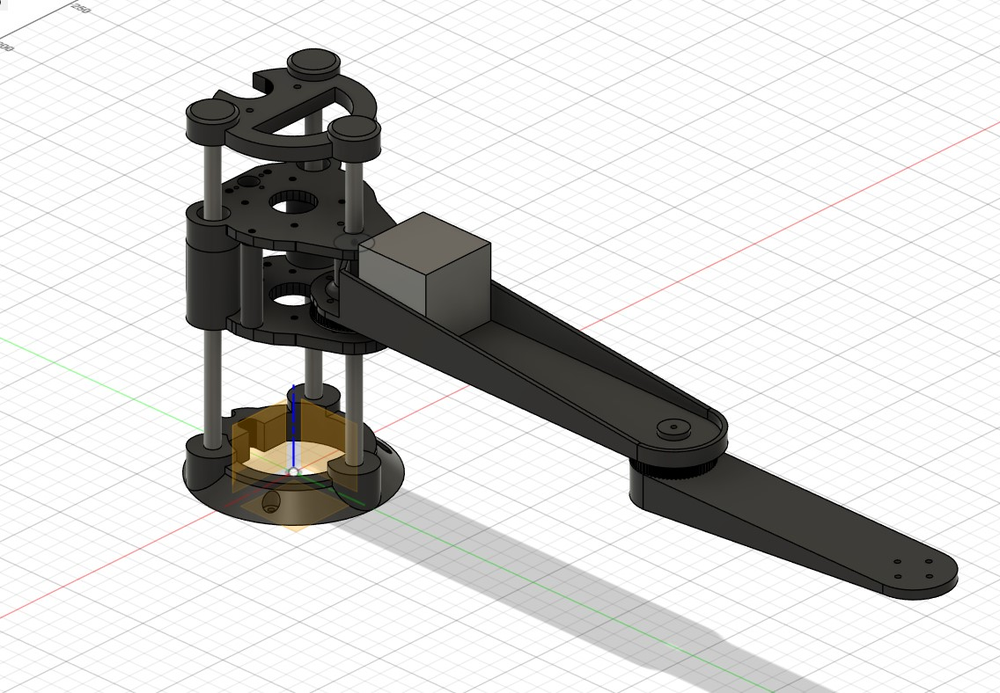

# SCARA robot arm, to play chess!!
This robot and system aims to be able to play a regular chess match against any human.

## CAD

## OpenCv Auto homing demo

## OpenCv board detection demo
By modyfing the output of the function findChessboardCorners(), using numpy, I got to map all the squares of a regular chess board

## OpenCv movement detection demo
Here I am comparing the MSE between every current square of the board agains every square of a pic where the board was empy, allowing the system to detect wich square has changed the most

